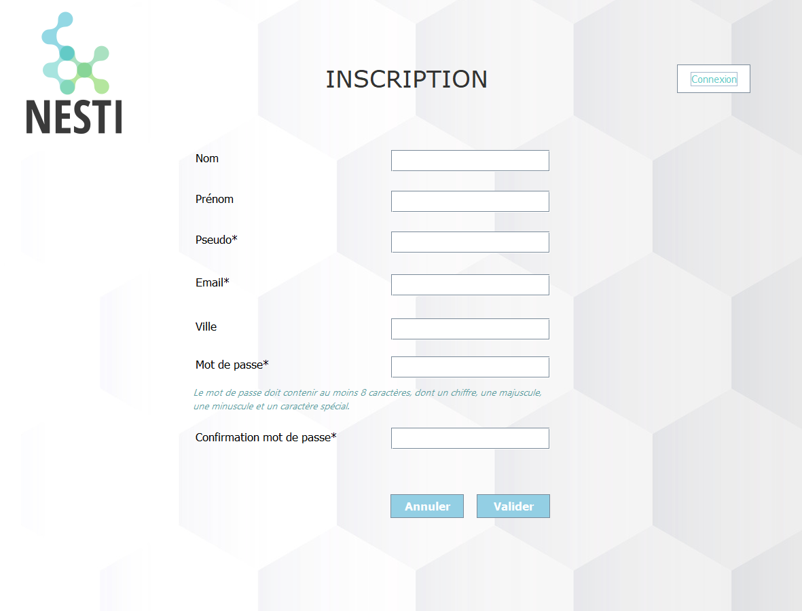

# Nesti
Language : Java

Objectif :
L'entreprise Nesti, vous demande de créer la partie "Connexion" d'une application Java. Elle se découpe en 4 parties : 
- Inscription
- Connexion 
- Affichage des informations de l'utilisateur
- Modification des informations de l'utilisateur

L'utilisateur peut se connecter soit par l'email, soit par le pseudo. Le mot de passe doit être fort. Il peut renseigner son nom, son prénom et sa ville lors de l'inscription, mais cela n'est pas obligatoire.
Une fois la connexion réussie, une nouvelle fenêtre s'ouvre et affiche les informations de l'utilisateur connecté. Il pourra, alors, modifier  ou compléter ses propres informations.
L'application doit contenir des tests unitaires.

